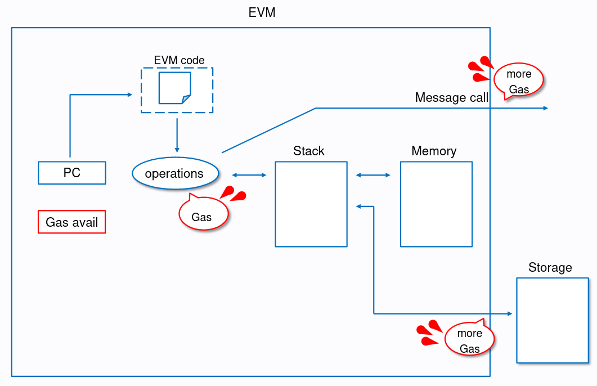

## What is gas?

All programmable compution in Ethereum is subject to fees, which are paid in gas. The gas fees should encourage writing efficient code and discourage spamming activities.



Each opcode (EVM instruction) has a fixed cost which is paid upon execution. Some opcodes have a dynamic cost on top of the fixed cost, which is dependant on several factors. Opcodes with a dynamic gas cost are for example the instructions related to storage or memory.

The more complex your transaction, so the more instruction it takes to execute, the more fees you have to pay (values taken from [Ethereum Gas Tacker](https://etherscan.io/gastracker)):

- [ETH Transfer](https://etherscan.io/tx/0x051f99743f8d211bf24ab7e6aec7dc17a6a7335fe12579b6c58cba856a2988cf): 21k gas
- [ERC20 Transfer](https://etherscan.io/tx/0xb3e3302626b84b7c56f99e492dddcbcbd9db6dbbcc5253c8e0e8a7bb49ca4ece): ~65k gas
- [ERC721 Transfer](https://etherscan.io/tx/0xcb6e7feb1554d21fc79c404afab2f62691b1fd208ab32e0facbc16d49f135e42): ~84k gas
- [Uniswap V3 Swap](https://etherscan.io/tx/0xad311b66f5fe7b5145f695752e6b0b1caab09c4beeb5e929eb45634c00e975a5): ~184k gas
- [Tornado Cash Deposit](https://etherscan.io/tx/0xedc2c859c46bf469119121636646447e6fdec0469bc56a45f0a00b3eda887350): ~1M gas

To prevent the network from being clogged up with transactions that use too much gas, there is a current block gas limit of 30 million gas. If a transaction exceeds the block gas limit, it will be rejected.

A seen above a standard ETH transfer costs 21k gas, which is the minimum amount of gas required to execute a transaction on the Ethereum network. So in theory, you could fit 1428 ETH transfers in a block (30 million / 21k).

## Gas price

Since EIP-1559, the gas price consists of a

- Base fee, which is set dynamically based on network demand and is burned
- Priority fee, which is a tip for validators to prioritize your transaction

The fee you pay in USD is calculated as follows:

```
(gas used x gas price (in gwei) x ether price (in USD)) / 1 billion
```

For example, with a gas price of 50 gwei and an ETH price of $2k a standard ETH transfer costs

```
(21k x 50 x 2000) / 1 billion = $2.1
```

## References

- [Gas and fees](https://ethereum.org/en/developers/docs/gas/)
- [Ethereum Gas Tracker](https://etherscan.io/gastracker)
- [EIP-1559](https://eips.ethereum.org/EIPS/eip-1559)
- [What you need to know about EIP-1559](https://medium.com/loom-network/what-you-need-to-know-about-eip-1559-603129db5782)
